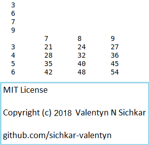

# Multiplication Table
Simple example of Multiplication Table and how to use loops and tabulation in Python

### Reference to:
[1] Valentyn N Sichkar. Multiplication Table in Python // GitHub platform [Electronic resource]. URL: https://github.com/sichkar-valentyn/Multiplication_Table (date of access: XX.XX.XXXX)

## Description
Program creates Multiplication Table in rectangular blocks.
The inputs are given with four numbers a, b, c and d, each in its line.
The program displays a fragment of the Multiplication Table for all numbers of the segment [a, b] on all numbers of the segment [c, d].

To separate the elements inside the string, the '\t' tab character is used.
The left column and the top row display the numbers from the specified segments - the header's column and the header's row.

## Multiplication Table

## MIT License
## Copyright (c) 2018 Valentyn N Sichkar
## github.com/sichkar-valentyn
### Reference to:
[1] Valentyn N Sichkar. Multiplication Table in Python // GitHub platform [Electronic resource]. URL: https://github.com/sichkar-valentyn/Multiplication_Table (date of access: XX.XX.XXXX)
